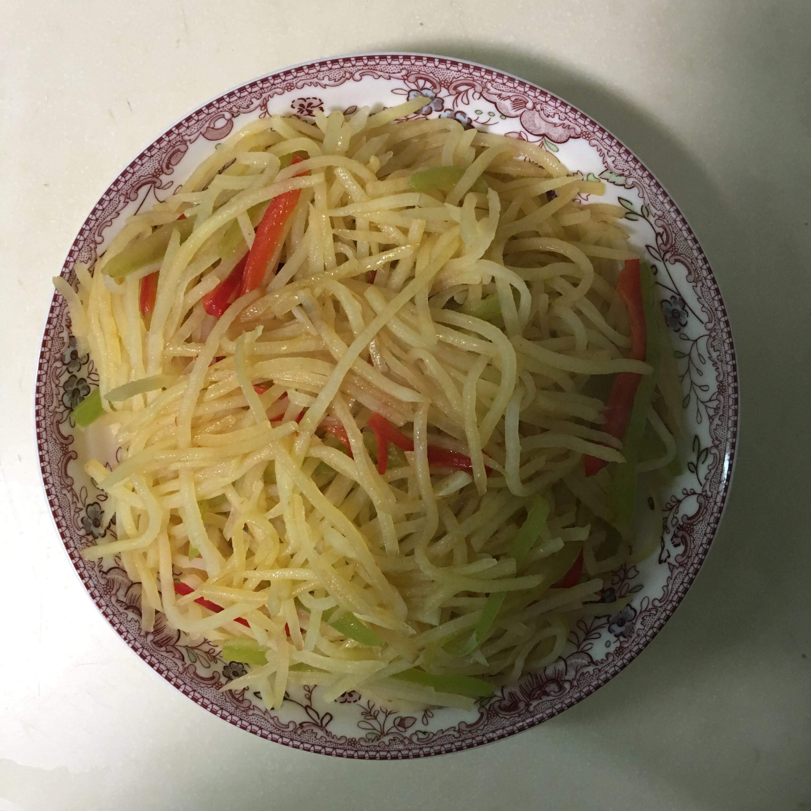

# 炒土豆丝

## 关于切土豆丝

如果你有充裕的时间,并且想磨炼刀工,可以自己用菜刀切,或者用刨丝的工具,实在不济,则可以买现成的切好的真空包装的土豆丝,注意一定要买最新鲜的.

## 关于炒之前对土豆丝的处理

- 用清水洗土豆丝,去掉一些**淀粉**,洗到水的颜色澄清就可以

- 在沸水里焯一会儿土豆丝,继续去掉一部分**淀粉**,并且使得土豆丝处于半熟的状态,后续的炒制时间可以缩短,稍微焯一会即可,捞出沥干水分备用

## 怎么炒

锅烧热后倒入油,油温热的时候加入切好的葱花爆锅,加入切好的**青红椒**,翻炒片刻,加入土豆丝翻炒片刻,加盐味精和**醋**来调味,醋的加入可以使得土豆丝口感更脆,临出锅的时候再加入蒜片翻炒几下即可.

